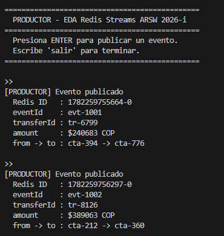
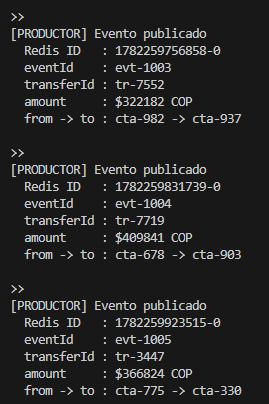
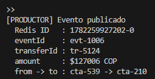
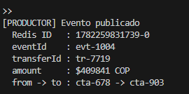
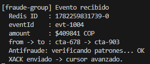
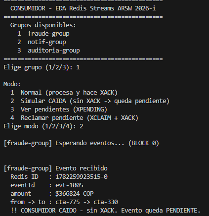
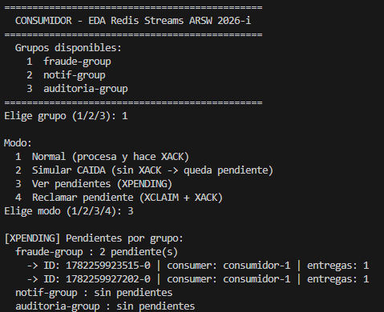
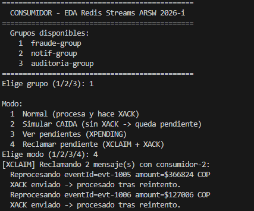

# EDA + Redis Streams 

## Author: Daniel Esteban Rodriguez Suarez

## How to run

### Requirements
- JDK 17+
- Maven 3.9+
- Docker

### Start Redis

```bash
docker run --name redis-eda -p 6379:6379 -d redis:7
```

### Terminal 1 — Productor

```bash
mvn compile exec:java "-Dexec.mainClass=eda.MainProductor"
```

### Terminal 2 — Consumidor

```bash
mvn exec:java "-Dexec.mainClass=eda.MainConsumidor"
```

---

## Description

This project demonstrates an **Event-Driven Architecture (EDA)** using **Redis Streams** as the event broker. It simulates a banking system where a money transfer event (`TransferenciaCreada`) is published by a producer and independently consumed by three consumer groups: fraud detection, notifications, and auditing.

The demo runs across **two terminals** to reflect a real distributed architecture — the producer and consumer are separate processes that communicate only through the Redis stream, with no direct coupling between them.

---

## Project Structure

```
ARSW-Taller3-Eventos/
├── pom.xml
└── src/main/java/eda/
    ├── RedisConnection.java   — Jedis connection singleton
    ├── Productor.java         — Publishes events with XADD
    ├── Consumidor.java        — Reads, ACKs, and claims pending events
    ├── MainProductor.java     — Producer entry point (Terminal 1)
    └── MainConsumidor.java    — Consumer entry point (Terminal 2)
```

---

## Architecture

```
Terminal 1                      Redis Stream                  Terminal 2
(MainProductor)                banco.transferencias          (MainConsumidor)
      |                               |                             |
      |------- XADD evento ---------->|                             |
                                      |<------ XREADGROUP ----------|
                                      |        (fraude-group)       |
                                      |        (notif-group)        |
                                      |        (auditoria-group)    |
                                      |-------- evento ------------>|
                                      |<------ XACK (si OK) -------|
                                      |     (pendiente si CAIDA)    |
                                      |<------ XCLAIM + XACK -------|
```

Each consumer group receives its own independent copy of every event. They do not compete with each other — only consumers within the same group share the load.

---

## Redis Commands Used

| Command | Purpose |
|---------|---------|
| `XADD` | Publish a new event to the stream |
| `XGROUP CREATE` | Initialize a consumer group |
| `XREADGROUP` | Read the next undelivered event for a group |
| `XACK` | Confirm that an event was processed successfully |
| `XPENDING` | List events that were delivered but not yet acknowledged |
| `XCLAIM` | Transfer a pending event to a different consumer for reprocessing |

---

## Demo Flow

The full activity suggested in the course slides is demonstrated in the following order:

### Step 1 — Publish an event (Terminal 1)

Press **ENTER** in the producer terminal. A `TransferenciaCreada` event is written to the stream with `XADD`.

```
[PRODUCTOR] Evento publicado
  Redis ID   : 1782258879023-0
  eventId    : evt-1001
  transferId : tr-5276
  amount     : $71904 COP
  from -> to : cta-977 -> cta-159
```

### Step 2 — Consume normally (Terminal 2, mode 1)

Each group reads the event with `XREADGROUP`, processes it, and confirms with `XACK`. The three groups are independent — all three receive the same event without competing.

```
[fraude-group] Evento recibido
  Redis ID   : 1782258879023-0
  eventId    : evt-1001
  amount     : $71904 COP
  from -> to : cta-977 -> cta-159
  Antifraude: verificando patrones... OK
  XACK enviado -> cursor avanzado.
```

### Step 3 — Simulate consumer crash (Terminal 2, mode 2)

The consumer reads the event but crashes before calling `XACK`. The event remains in a **PENDING** state for that group.

```
[fraude-group] Evento recibido
  Redis ID   : 1782258879023-0
  eventId    : evt-1001
  !! CONSUMIDOR CAIDO - sin XACK. Evento queda PENDIENTE.
```

### Step 4 — Inspect pending events (Terminal 2, mode 3)

`XPENDING` shows which events are stuck and which consumer was responsible.

```
[XPENDING] Pendientes por grupo:
  fraude-group : 1 pendiente(s)
    -> ID: 1782258879023-0 | consumer: consumidor-1 | entregas: 1
  notif-group : sin pendientes
  auditoria-group : sin pendientes
```

### Step 5 — Reclaim and reprocess (Terminal 2, mode 4)

`XCLAIM` transfers the pending event to `consumidor-2`, which reprocesses it and sends the `XACK`.

```
[XCLAIM] Reclamando 1 mensaje(s) con consumidor-2:
  Reprocesando eventId=evt-1001 amount=$71904 COP
  XACK enviado -> procesado tras reintento.
```

---

## Key Design Concepts

**Event naming in past tense:** `TransferenciaCreada` signals that the fact already happened. Producers do not instruct consumers — they report what occurred.

**No direct coupling:** The producer never calls the consumer directly. It writes to the stream and any number of consumers can react independently.

**Consumer groups:** Each group (`fraude-group`, `notif-group`, `auditoria-group`) maintains its own read cursor. One group processing an event does not affect the others.

**Reliability over Pub/Sub:** Redis Streams persist events with IDs and track delivery per group. Unlike simple Pub/Sub, a consumer that goes offline will not lose events — they wait in a pending state until acknowledged or reclaimed.

**Idempotency with `eventId`:** Every event carries a unique `eventId`. Consumers can use this to detect and safely ignore duplicate deliveries during reprocessing.

---

## Evidence

### Terminal 1 — Producer publishing events







### Terminal 2 — Consumer receiving events in real time





### Consumer crash simulation — event left pending



### XPENDING showing the stuck event



### XCLAIM reprocessing and acknowledging


